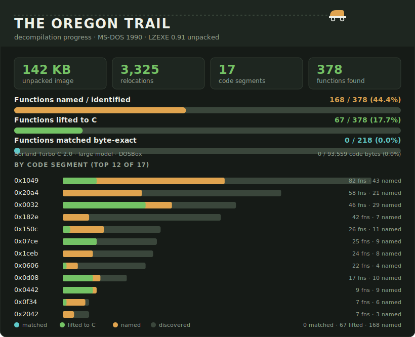

# OTrailDecomp

A decompilation effort for the MS-DOS release of **The Oregon Trail** (1990).



> Progress dashboard is generated by `xmake decomp` from `config/segments.json`
> and `config/symbols.json`.

## What this is (and what it isn't)

The target, `Oregon_The_1990/OREGON.EXE`, is **packed with LZEXE 0.91** (the
`LZ91` signature is at MZ offset `0x1C`). That single fact drives everything:
the bytes in the packed file are LZ77-compressed, so they cannot be disassembled
or decompiled directly. **Step one is always to unpack.**

> Earlier iterations of this repo chopped the *packed* file into hundreds of
> `src/unit_*.c` byte-array files and reported "100% byte coverage." That only
> proved the compressed bytes could be copied verbatim — it was not
> decompilation. That scaffolding (and a homegrown, incorrect unpacker) has been
> removed; it remains in git history. See `docs/LZEXE_unpacking.md`.

## Documentation

- [`docs/ARCHITECTURE.md`](docs/ARCHITECTURE.md) — how the game is structured:
  the segment→module map, program flow, data model, and assets.
- [`docs/LZEXE_unpacking.md`](docs/LZEXE_unpacking.md) — how the packed EXE is
  reversed into the analysable image.
- [`docs/decompiling.md`](docs/decompiling.md) — the per-function lifting
  workflow and conventions.
- [`docs/matching.md`](docs/matching.md) — the plan and harness for a
  byte-identical rebuild (the matching endgame).
- [`docs/segment_map.md`](docs/segment_map.md) — generated segment/function map.

## Layout

| Path                            | Purpose                                            |
|---------------------------------|----------------------------------------------------|
| `Oregon_The_1990/`              | Original game files (the packed `OREGON.EXE`)      |
| `tools/unlzexe.py`              | LZEXE 0.91 unpacker (decompression + relocations)  |
| `tools/map_segments.py`         | Segment / function map from the unpacked image     |
| `tools/render_progress_svg.py`  | Generates the README progress dashboard            |
| `tools/verify.py`               | Structural regression gate                         |
| `src/`                          | Lifted C, one file per segment/subsystem           |
| `config/symbols.json`           | Living symbol table (named functions + globals)    |
| `config/segments.json`          | Generated: machine-readable segment/function map   |
| `build/OREGON_unpacked.exe`     | Generated: plain relocatable MZ executable         |
| `docs/`                         | Documentation (see above) + generated artifacts    |
| `logic/`                        | Reserved for shared lifted modules                 |

## Prerequisites

- Python 3.10+ (the decompilation tools read and analyse the binary)
- [xmake](https://xmake.io) (build front-end; it auto-downloads SDL2)
- `ndisasm` (NASM) or Ghidra/IDA for disassembly (optional)
- `OREGON.EXE` present at `Oregon_The_1990/OREGON.EXE`

## Usage

[xmake](https://xmake.io) is the single front-end. It builds the playable port
and **downloads SDL2 for you** — no manual dependencies. Python 3 runs the
decompilation tools underneath.

```bash
xmake                  # build the port (fetches SDL2 automatically)
xmake run oregon_trail # play it — an SDL window, or a screenshot tour if headless

xmake decomp           # reverse-engineer the original game (unpack, map, verify, svg)
xmake verify           # re-check the unpack (the regression gate)
xmake assets           # extract the game art
xmake status           # how far the project has come
```

Builds go in `build/`: `OREGON_unpacked.exe` (the decompiled game) and
`oregon_trail` (the port). To build the headless backend instead (no SDL, writes
PNG frames), configure it off once: `xmake f --sdl=n && xmake`.

## Status

- **Unpacking: done and verified.** `xmake verify` re-derives the unpacked image
  from scratch and checks it is byte-stable, that all 3325 relocations are valid,
  and that the entry point decodes as `main()`.
- **Segment map: complete.** 17 code segments holding ~378 functions are
  identified (union of far-call targets and Borland stack-frame prologues; the
  `framed` count separates app-logic segments from hand-written graphics/runtime
  modules). See [`docs/segment_map.md`](docs/segment_map.md).
- **Decompilation: underway.** The whole control-flow spine is lifted —
  title menu, new-game setup (occupation / party / departure month / store),
  the trail loop, the per-turn action dispatch, river crossing, and the hunting
  minigame — all confirmed against the in-binary strings. Lifted source lives in
  `src/`; see [`docs/ARCHITECTURE.md`](docs/ARCHITECTURE.md) for the full map and
  the live dashboard above for coverage. Remaining depth is in the individual
  action handlers and the graphics/runtime libraries.

## Contributing

To lift another function, follow [`docs/decompiling.md`](docs/decompiling.md):
disassemble from the unpacked image, write annotated C under `src/`, record the
names in `config/symbols.json`, then `xmake decomp` and keep `xmake verify` green.
